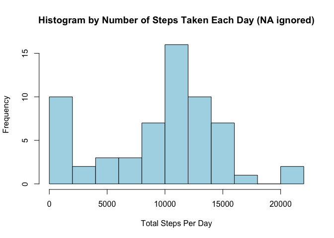
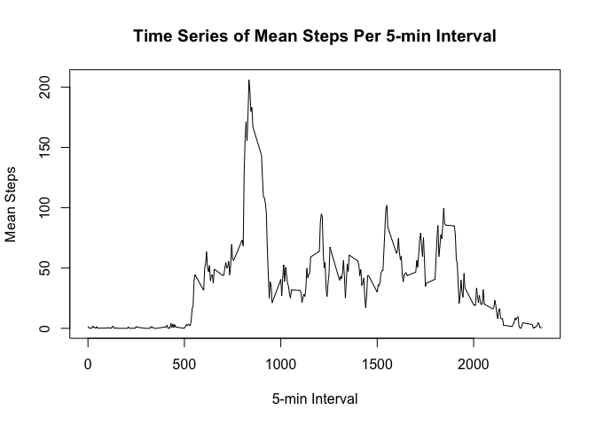
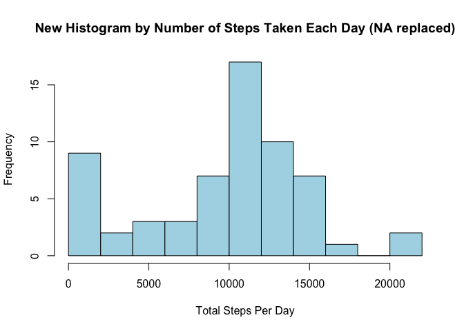
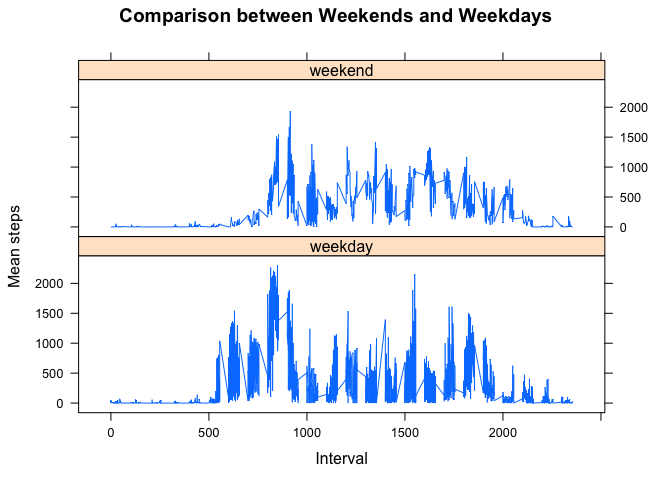

# Reproducible Research: Peer Assessment 1


## Loading and preprocessing the data

1. Load data

```r
activity <- read.csv('activity.csv')
```
2. Process data

```r
#Transform to date object
activity$datetime <- as.Date(activity$date, format='%Y-%m-%d')
#weekend/weekday variable
activity$dow <- weekdays(activity$datetime)
activity$weekend <- ifelse(activity$dow == 'Saturday' | activity$dow == 'Sunday', 'weekend', 'weekday')
```

## What is mean total number of steps taken per day?
1. Calculate the total number of steps taken per day

```r
daily_steps <- aggregate(activity$steps, by=list(activity$datetime), FUN=sum, na.rm=TRUE)
names(daily_steps) <-c('datetime','steps')
```
2. Make a histogram of the total number of steps taken each day

```r
hist(daily_steps$steps, breaks=10,col='lightblue',
xlab='Total Steps Per Day', main='Histogram by Number of Steps Taken Each Day (NA ignored)')
```

\

```r
dev.copy(png, file='plot_hist.png')
```

```
## quartz_off_screen 
##                 3
```

```r
dev.off()
```

```
## quartz_off_screen 
##                 2
```
3. Calculate and report the mean and median of the total number of steps taken per day

```r
#mean
mean_steps <- mean(daily_steps$steps)
#median
median_steps <- median(daily_steps$steps)
#output mean and median
mean_steps
```

```
## [1] 9354.23
```

```r
median_steps
```

```
## [1] 10395
```
Daily mean steps is 9354.23 while daily median steps is 10,395.

## What is the average daily activity pattern?
1. Time series plot (i.e. type = "l") of the 5-minute interval (x-axis) and the average number of steps taken, averaged across all days (y-axis)

```r
#Get y-axis
mean_interval <- aggregate(activity$steps, by=list(activity$interval),FUN=mean, na.rm=TRUE)
names(mean_interval) <-c('interval','mean')
#Plot
plot(mean_interval$interval, mean_interval$mean, type='l', xlab='5-min Interval',
ylab='Mean Steps', main='Time Series of Mean Steps Per 5-min Interval')
```

\

```r
#Save file
dev.copy(png, file='time_series.png')
```

```
## quartz_off_screen 
##                 3
```

```r
dev.off()
```

```
## quartz_off_screen 
##                 2
```
2. 5-min interval with max number of step is 835

```r
#Find max position
max_pos <- which(mean_interval$mean == max(mean_interval$mean))
#Get the max interval
max_interval <-mean_interval[max_pos,]
#output max interval
max_interval
```

```
##     interval     mean
## 104      835 206.1698
```

## Imputing missing values
1. There are 2,304 missing values in the data set

```r
#Calculate NAs
all_na <- sum(is.na(activity))
#output
all_na
```

```
## [1] 2304
```
2. Fill in the missing values with mean of that interval across days

```r
#Position which it's missing
miss_pos <- which(is.na(activity$steps))
#Create new data.frame
new<-activity
#Replace NAs
new[miss_pos, 'steps'] <- mean_interval[miss_pos, 'mean']
#Make new daily steps
new_daily_steps <- aggregate(new$steps, by=list(new$datetime), FUN=sum, na.rm=TRUE)
names(new_daily_steps) <-c('datetime','steps')
```
3. Repeat the process

```r
#Make new histogram
hist(new_daily_steps$steps, breaks=10,col='lightblue',
xlab='Total Steps Per Day', main='New Histogram by Number of Steps Taken Each Day (NA replaced)')
```

\

```r
#Save
dev.copy(png, file='plot_hist_new.png')
```

```
## quartz_off_screen 
##                 3
```

```r
dev.off()
```

```
## quartz_off_screen 
##                 2
```

```r
#mean
new_mean_steps <- mean(new_daily_steps$steps)
#median
new_median_steps <- median(new_daily_steps$steps)
#output new mean and median
new_mean_steps
```

```
## [1] 9530.724
```

```r
new_median_steps
```

```
## [1] 10439
```

```r
#SD for comparison
sd(daily_steps$steps)
```

```
## [1] 5405.895
```
The new mean is 9,530.724 and new median is 10,439. Both increase with the filling of missing data, despite the increase being relatively small compared to the original standard deviation of the original data set. No visually visible effect on histograms.

## Are there differences in activity patterns between weekdays and weekends?
1. Factorize weekend variable

```r
activity$weekend<-as.factor(activity$weekend)
```

2. Plot comparative time series for mean steps across weekdays or weekends

```r
#Get daily aggregate
last_activity <- aggregate(activity$steps, by=list(activity$weekend, 
activity$dow, activity$interval), FUN=sum, na.rm=TRUE)
names(last_activity) <-c('weekend','dow','interval','mean')
#Plot time series
library(lattice)
xyplot(mean ~ interval | weekend, last_activity, 
       type="l", 
       lwd=1, 
       xlab="Interval", 
       ylab="Mean steps", 
       layout=c(1,2), main='Comparison between Weekends and Weekdays')
```

\

```r
#Save
dev.copy(png, file='time_sereis_new.png')
```

```
## quartz_off_screen 
##                 3
```

```r
dev.off()
```

```
## quartz_off_screen 
##                 2
```
